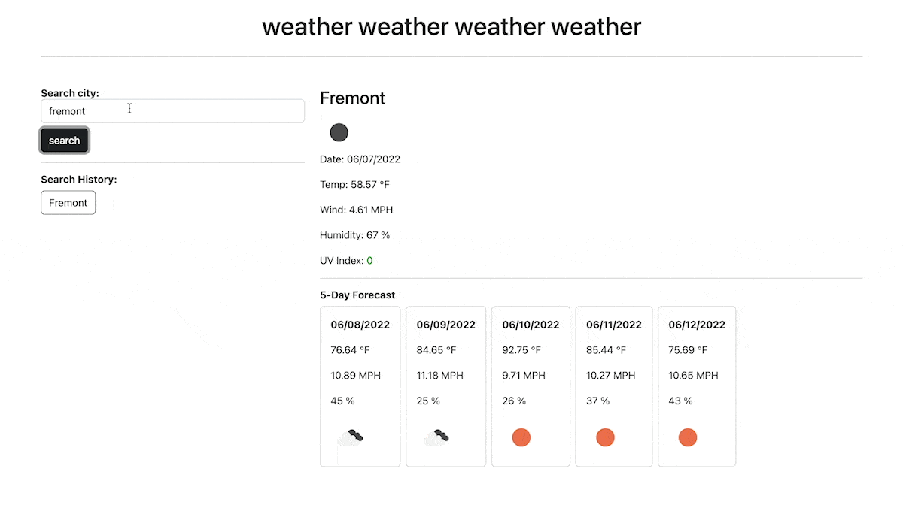

## 06 Weather Dashboard

### The Project

To create a weather dashboard using Third-party server-side APIs. 
This should be done by retrieving data from the other application's API through URL requests with specific parameters. 

This application will run in the browser and updated dynamically with HTML and CSS.

### User Story

```
AS A person who travels and/or indecisive about what to wear
I WANT to see the weather forecast for cities
SO THAT I can plan a dress and prepare for the weather accordingly
```

### Application Outline

```
GIVEN a weather site with form inputs
WHEN I enter the name for a city and search
THEN I am presented with most current and 5 day forecasts for that city and seeing that it is added to my search history
WHEN I look at the city forecast
THEN I am presented with the city name, current date, an icon of the weather condition, temperature, humidity, wind speed, and a color-coded UV index (favorable, moderate, or severe)
WHEN I look at the 5-day forecast of the city
THEN I can see dates, icon representation of weather conditions, temperature, wind speed, and humidity
WHEN I click on a search history city
THEN I am see the current and future conditions for that city again
```

### Mock-Up

The following image shows the web application's appearance and functionality:




### Credits

API from:
[OpenWeather One Call API](https://openweathermap.org/api/one-call-api)
[Current weather data](https://openweathermap.org/current)

Huge help Wilson Lam, Nolan Spencer, Angie Soto, and Scott Nelson 


